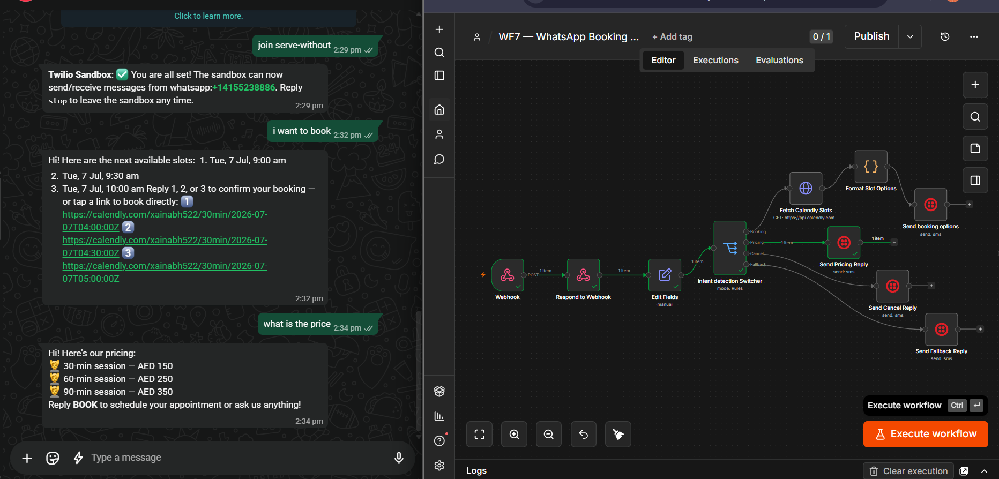

# WhatsApp Booking Bot — n8n + Calendly + Twilio

Automated WhatsApp assistant for a service-based business. 
Handles appointment booking, pricing queries, cancellations, 
and fallback routing — with full interaction logging.

Built during an AI Automation Engineering internship.

## Demo

> Customer sends "i want to book" → bot fetches live Calendly 
> slots → replies with 3 clickable booking links on WhatsApp

## What it does

- Receives WhatsApp messages via Twilio webhook
- Detects intent (Booking / Pricing / Cancel / Fallback) 
  using keyword rules
- Fetches real-time available slots from Calendly API
- Sends formatted reply with clickable booking links
- Logs every interaction (timestamp, phone, intent, message SID)
  to Google Sheets

## Architecture

Twilio WhatsApp → Webhook → Edit Fields → Intent Switcher
├── Booking → Fetch Calendly → Format → Send
├── Pricing → Send Pricing Reply
├── Cancel  → Send Cancel Link
└── Fallback → Send Help Message

## Tech Stack

| Tool | Role |
|------|------|
| n8n | Workflow automation engine |
| Twilio WhatsApp API | Messaging gateway |
| Calendly API | Real-time slot fetching |
| Google Sheets | Interaction logging |

## Intent Detection Rules

| Branch | Trigger Keywords |
|--------|-----------------|
| Booking | book, slot, appointment, schedule |
| Pricing | price, cost, how much, rate, fee |
| Cancel | cancel, reschedule, change slot |
| Fallback | anything else |

## Key Technical Decisions

- **Respond to Webhook node placed before processing** — 
  Twilio requires an immediate 200 OK or it retries the 
  webhook, causing duplicate messages
- **Switch node branch ordering matters** — n8n matches 
  first rule only, so Booking is checked before Fallback
- **Calendly API** requires Bearer token + event_type URI 
  as query parameters

## Sample Interaction Log

See [`data/sample-log.csv`](data/sample-log.csv)

## How to Import

1. Clone this repo
2. Open your n8n instance
3. Go to Workflows → Import → upload `workflow.json`
4. Add your credentials:
   - Twilio: Account SID + Auth Token
   - Calendly: API Bearer token
   - Google Sheets: OAuth2
5. Activate the webhook and connect your Twilio sandbox

## Project Documentation

Full task-by-task breakdown in [`docs/project-description.md`](docs/project-description.md)